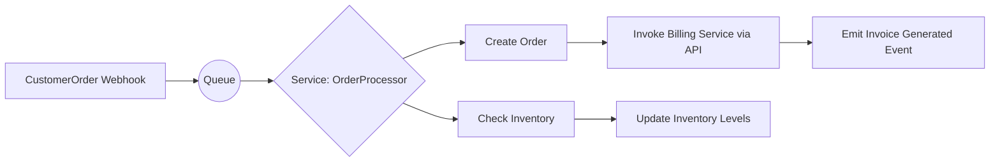
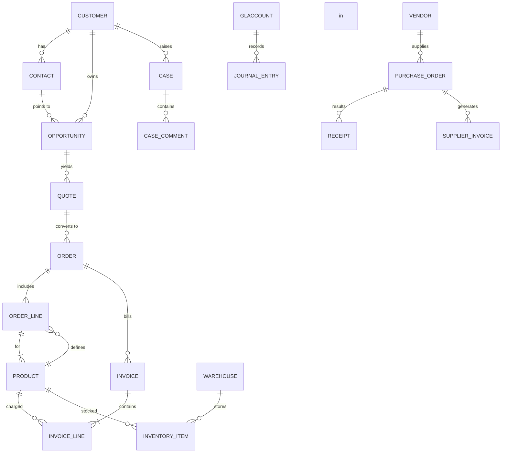
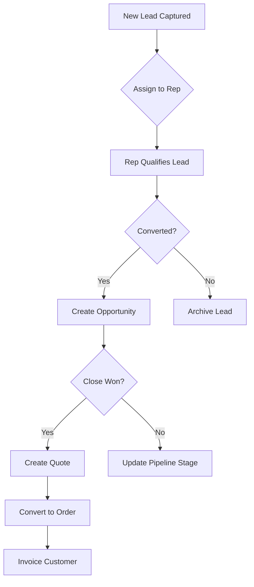

# Executive Summary

This report provides a comprehensive, technical specification for a combined CRM+ERP SaaS application. It details all **functional requirements** (CRM modules like sales, marketing, service and ERP modules like finance, inventory, HR, etc.) with their purposes, key entities, CRUD operations, business rules, expected volumes, and priority levels. It outlines **non-functional requirements** (scalability, availability, performance, latency targets, data retention, backup, GDPR/SOC2/PCI compliance, localization, accessibility). We compare **multitenancy models** (shared schema, isolated schema, isolated instance/hybrid) with data and resource isolation trade-offs (e.g. Salesforce’s shared-schema UDD model). We cover **multiuser security** (authentication via SAML/OAuth2/OIDC/MFA; authorization via RBAC/ABAC/row-level controls; session management; audit logs; encryption; key management). We specify **integration** needs (APIs: REST/GraphQL, webhooks, ETL/middleware, connectors, message queues, idempotent operations, eventual consistency patterns). We present a **data model** (core entities and relationships) with a sample Mermaid ER diagram. We discuss **architecture** options (SaaS vs on-prem vs hybrid deployment; microservices vs monolith; CI/CD pipelines; monitoring/observability; disaster recovery). 

We describe **8 key use cases** (sales pipeline, order-to-cash, procure-to-pay, inventory replenishment, support ticketing, financial close, HR onboarding, tenant onboarding) with user personas, workflows, and acceptance criteria. We provide a **security & compliance checklist** (controls like 2FA, encryption, logging, vulnerability management). An **implementation roadmap** outlines phases, milestones, team sizes, and risk mitigation strategies. Finally, we include a clear **application specification prompt** for developers and managers, and comparison tables (databases, tenancy models, auth methods). Diagrams (Mermaid ER and flowcharts) and cited sources support these recommendations. All content is up-to-date as of 2026.

## 1. Functional Requirements

### CRM Modules and Features 

- **Sales Management (Leads, Opportunities, Accounts, Contacts, Quotes, Orders, Invoices)** – Manage the sales pipeline from lead capture through deal closure.  
  - **Purpose:** Track prospects and deals. Convert leads to opportunities and orders, generate quotes, and invoice customers.  
  - **Key Entities:** *Lead*, *Account/Company*, *Contact*, *Opportunity*, *Product*, *PriceBook*, *Quote*, *Order*, *Invoice*, *Contract*.  
  - **CRUD Ops:** Create/Read/Update/Delete (CRUD) on leads, accounts, contacts, opportunities. E.g., create new *Lead* records when inbound leads arrive; convert *Lead*→*Opportunity* and *Account*. Manage *Products*, *Quotes*, and *Orders* linked to opportunities.  
  - **Business Rules:** Lead assignment and qualification rules; opportunity stages (e.g. qualification, negotiation, closed-won/lost) with validation of required fields; discount approval workflows on quotes; order fulfillment triggers invoicing; invoice aging/payment follow-up. For example, when a *Lead* is marked “Qualified,” the system generates an *Opportunity*. When an opportunity is won, a *Quote* can be generated, then converted to an *Order* and later *Invoice*. 
  - **Performance:** Support thousands of leads/opportunities daily, with real-time updates to pipelines and dashboards. Searches and report filters should return results in <1s under typical load. Expected throughput ~1000+ transactions/day for large tenants. 
  - **Priority:** **Must**. Core CRM functionality; no comparable fallback if missing.

- **Contact Management** – Maintain a centralized address book of *Accounts* and *Contacts*.  
  - **Purpose:** Store customer and company contact details for all modules.  
  - **Key Entities:** *Contact*, *Account* (Organization), *Address*, *InteractionLog* (calls/emails).  
  - **CRUD:** Add/update/delete customers and contacts. Log communications and link to accounts.  
  - **Rules:** Unique contact per email; merge duplicates; data privacy (GDPR) flags on contacts.  
  - **Priority:** **Must**.

- **Marketing Automation** – Manage campaigns, leads, and marketing analytics.  
  - **Purpose:** Generate and nurture leads, manage campaigns (email, events, ads). Improve lead quality.  
  - **Entities:** *Campaign*, *CampaignMember* (linking Contacts/Leads to campaigns), *EmailTemplate*, *MarketingList*, *Email*, *LeadScore*.  
  - **CRUD:** Create campaigns, add targets (contacts/leads) to campaigns, send templated emails. Track campaign interactions (opens/clicks).  
  - **Rules:** Lead scoring rules based on interactions; opt-in/opt-out consent for GDPR; duplicate suppression; campaign budgets and ROI tracking.  
  - **Performance:** Bulk email sends (thousands per campaign); analytics on response rates.  
  - **Priority:** **Should** (essential for growth).

- **Customer Service (Ticket/Case Management)** – Handle customer support requests and service agreements.  
  - **Purpose:** Log and resolve customer issues and requests. Maintain high CSAT.  
  - **Entities:** *Case/Ticket*, *Contact*, *Account*, *ServiceContract*, *Entitlement*, *KnowledgeArticle*, *CaseComment*.  
  - **CRUD:** Create cases from web forms, email, or phone. Assign to agents, update status, close cases. Link to customers and products.  
  - **Rules:** SLA enforcement (e.g. auto-escalate if not responded in X hours); case routing rules (e.g. by geography or product); case re-open if customer replies.  
  - **Performance:** Real-time updates for queues; handle concurrent chat/conference support; cases per agent ~10–50/day.  
  - **Priority:** **Should** (critical for retention).

- **Quotes & Order Management** – Generate sales quotes, track orders and fulfillments.  
  - **Purpose:** Formalize price proposals and order processing. Streamline order-to-cash.  
  - **Entities:** *Quote*, *QuoteLineItem*, *Order*, *OrderLineItem*, *Shipment*, *Invoice*, *Payment*.  
  - **CRUD:** Create quotes from opportunities; edit line items (products, quantities, prices, discounts); convert quote to order. Update order status (pending, shipped, cancelled). Generate *Invoice* from orders.  
  - **Rules:** Quote versions, approval (e.g. discounts over threshold require manager approval). Multi-currency pricing. Inventory check on order. Payment terms on invoice.  
  - **Performance:** Support generating 100s of quotes/day; batch operations (e.g. mass order import).  
  - **Priority:** **Must**.

- **Reporting & Analytics (BI)** – Provide dashboards and reports across CRM & ERP data.  
  - **Purpose:** Deliver insights (sales forecasts, pipeline, inventory levels, financials).  
  - **Entities:** *Report*, *Dashboard*, *Metric*. Underlying fact tables (sales, orders, transactions).  
  - **CRUD:** Build custom reports/dashboards by users. Drill-down on charts.  
  - **Rules:** Data access based on roles (e.g. sales managers see team pipeline, not others'). Scheduled report generation.  
  - **Performance:** Interactive dashboards (sub-second load on aggregated queries) and overnight batch reports. Data sync latency <1 hour from transactions.  
  - **Priority:** **Must**.

- **Workflows/Process Automation** – Automate business processes (approvals, notifications).  
  - **Purpose:** Enforce business logic without manual steps.  
  - **Entities:** *WorkflowDefinition*, *ProcessInstance*, *Task*.  
  - **CRUD:** Define new workflows (e.g. use BPM engine or low-code builder). Automate steps on record changes (e.g. auto-assign cases, auto-approve POs under $X).  
  - **Rules:** Conditional branching, multi-step approvals. Support loops/retries.  
  - **Performance:** Handle triggers on high-transaction tables efficiently (e.g. shipping hundreds of orders should trigger 100s of events without lag).  
  - **Priority:** **Must**.

- **Document Management** – Store and manage attachments (e.g. contracts, invoices).  
  - **Purpose:** Centralize files related to CRM/ERP records.  
  - **Entities:** *Document*, *Attachment*, *Folder*, *Version*. Link docs to Accounts, Orders, etc.  
  - **CRUD:** Upload/download documents; tag and version control; full-text search.  
  - **Rules:** Virus scanning on upload; file size limits; retention policies (auto-delete after X years if required).  
  - **Performance:** Fast retrieval; scalable storage (e.g. cloud blob store).  
  - **Priority:** **Could** (useful but may integrate with external DMS).

- **Mobile & Offline Access** – Enable field/mobile access.  
  - **Purpose:** Allow sales/service reps to work on mobile devices and offline.  
  - **Features:** Responsive/mobile UI or native apps; offline data sync (local DB + conflict resolution).  
  - **Entities (offline):** Local cache of key entities (Contacts, Opportunities, Cases).  
  - **Operations:** CRUD on cached records; sync when online.  
  - **Business Rules:** Conflict resolution (e.g. “last write” or user merge); limit offline data volume.  
  - **Performance:** Sync in background; offline UIs must be snappy (<200ms interactions).  
  - **Priority:** **Could/Should** (depends on mobile workforce requirement).

### ERP Modules and Features

- **Financial Management (Accounting)** – General ledger, AR/AP, billing, budgeting.  
  - **Purpose:** Manage company finances, transactions, and reporting.  
  - **Entities:** *GLAccount*, *JournalEntry*, *Invoice* (Sales AR), *Bill* (Purchase AP), *Payment*, *Asset*, *Budget*.  
  - **CRUD:** Post transactions (sales invoices, purchase bills). Run period-end closings.  
  - **Rules:** Double-entry bookkeeping. Recurring entries (depreciation). Multi-currency translations. Approval of payments.  
  - **Performance:** Thousands of journal entries daily for larger tenants. Financial consolidations (multi-entity).  
  - **Priority:** **Must**.

- **Human Resources (HR/HCM)** – Employee records, payroll, recruitment, performance.  
  - **Purpose:** Manage personnel lifecycles and payroll.  
  - **Entities:** *Employee*, *Job*, *PayrollRun*, *TimeOffRequest*, *Benefit*, *PerformanceReview*, *RecruitmentCandidate*.  
  - **CRUD:** Onboard/terminate employees, submit leave, run payroll.  
  - **Rules:** Payroll tax calculations, vacation accruals, mandatory fields for new hire (e.g. SSN, bank info). Role-based visibility (managers vs employees).  
  - **Performance:** Global setups (multi-country payroll), hundreds of monthly runs.  
  - **Priority:** **Should** (key for full ERP, optional if CRM-only focus).

- **Inventory & Warehouse Management** – Track stock levels and storage.  
  - **Purpose:** Ensure optimal inventory, track locations, support MRP.  
  - **Entities:** *Item/Product*, *StockLevel* (per Warehouse), *Warehouse/Location*, *InventoryTransaction*, *CycleCount*.  
  - **CRUD:** Adjust stock (receipts, shipments), create transfer orders, perform counts.  
  - **Rules:** Reorder triggers when below threshold; lot/serial tracking; expiration dates; warehouse picking rules.  
  - **Performance:** Manage large catalogs (10k+ SKUs), multi-warehouse updates real-time (tens of transactions/sec).  
  - **Priority:** **Must** (for any product-based business).

- **Procurement** – Purchase orders and supplier management.  
  - **Purpose:** Automate buying process from requisition through payment.  
  - **Entities:** *Vendor/Supplier*, *PurchaseRequisition*, *PurchaseOrder*, *Receipt* (GoodsReceipt), *SupplierInvoice*.  
  - **CRUD:** Create requisitions, convert to purchase orders; receive goods; record supplier invoices and payments.  
  - **Rules:** Three-way match (PO-Receipt-Invoice) before paying; approval workflow for POs (by amount/department); vendor payment terms.  
  - **Performance:** Bulk PO imports, often monthly volume. Real-time inventory update on receipt.  
  - **Priority:** **Must** (to close procure-to-pay loop).

- **Manufacturing (MRP/Production)** – Bill of Materials (BOM), Work Orders, scheduling.  
  - **Purpose:** Plan and manage production runs.  
  - **Entities:** *Item* (finished good, component), *BOM*, *WorkOrder/ProductionOrder*, *Routing*, *Capacity*.  
  - **CRUD:** Create BOMs; generate work orders from demand; record production completions; scrap.  
  - **Rules:** Explode BOM to compute part requirements; scheduling rules (finite/infinite capacity); track variance (planned vs actual).  
  - **Performance:** MRP run should compute needs for thousands of SKUs in minutes.  
  - **Priority:** **Should** (essential for manufacturing businesses).

- **Sales Order Management** – Overlaps with CRM orders; manages fulfillment.  
  - **Purpose:** Merge CRM orders with fulfillment/inventory.  
  - **Entities:** *SalesOrder*, *Fulfillment*, *Invoice* (see Orders).  
  - **CRUD:** Enter sales orders (if not from CRM), reserve inventory, generate shipments.  
  - **Rules:** Credit check before order processing; backorder management.  
  - **Priority:** **Must**.

- **Business Intelligence (BI) & Analytics** – (covered above with reporting).  
  - **Purpose:** Aggregate data across modules for KPIs and dashboards.  
  - **Tools:** OLAP cubes, data warehouses, dashboards.  
  - **Priority:** **Should**.

- **Workflows and Process (covered above).**

- **Document/Content Management** – (covered above).

- **Mobile/Offline** – (covered above).

- **Other ERP Features:** Advanced Planning, Quality Control, Asset Management, etc. These may be **Could** or **Should** depending on scope.

## 2. Non-Functional Requirements

- **Scalability:** Must handle growth in users, tenants, and data. Use cloud scaling (auto-scaling instances, databases). Horizontal scaling of stateless services. Partition data (see Data Model section). For multi-tenant shared-db, the app must enforce `tenant_id` filters on queries. Performance target: <200ms API response under normal load; linear scaling to thousands of concurrent users.  
- **Availability:** Aim for ≥99.9% uptime (SLA). Use redundant application servers and databases across AZs/regions. Active-active clusters, load balancers, health checks. Automate failover and graceful degradation (e.g. read-only mode for reporting if write DB is down).  
- **Performance/Latency:** Sub-second UI interactions and API calls. Real-time updates for key operations. Batch jobs (e.g. reports) run off-peak. CDN or caching for static content. Optimize DB indexes on key entity tables (e.g. Opportunity, Order).  
- **Data Retention & Backup:** Comply with retention policies (e.g. keep financial records 7+ years). Automated, regular backups (daily snapshots, transaction log backups). Use versioned storage for documents. Test restores periodically. Retention and deletion per tenant policy (e.g. GDPR “right to be forgotten”).  
- **Compliance:** Support **GDPR** (data subject rights: consent, access, erasure), **SOC 2** (security, availability, processing integrity, confidentiality, privacy controls), **PCI DSS** if processing payments (encrypt card data, limited retention, audit trails). Provide controls for security policies.   
- **Localization:** Multi-currency, multi-language (UI translation, right-to-left for applicable languages). Date/number formats per locale. Time zone handling.  
- **Accessibility:** WCAG 2.1 compliance (contrast, keyboard nav, ARIA labels). Screen-reader support. Mobile-responsive design or native accessible components.  
- **Other NFR:** Logging (centralized logs and tracing), monitoring (SLIs/SLOs, alerts), auditability (immutable logs for key events), GDPR/data privacy features (data encryption, consent management). Use ISO/IEC 25010 (quality model) to guide metrics.

## 3. Multitenancy Models

We consider three models:

- **Shared Schema (Pooled Database):** All tenants share the same database and table schemas; each row includes a `TenantID` for isolation.  
  - **Pros:** Lowest cost (resource sharing) and simplest maintenance/upgrades (one DB instance to patch). Easier to onboard new tenants. Highly scalable economy-of-scale.  
  - **Cons:** Highest need for strict query filters (a missing `WHERE TenantID=…` can leak data). Shared noisy neighbors (one heavy tenant can impact others). Harder to offer per-tenant schema customizations. Backups/restores per-tenant is complex.  
  - **Data Isolation:** Logical; isolation enforced by application and DB queries using TenantID.  
  - **Resource Isolation:** Minimal. Must use row-level security or strict tenancy flags.  
  - **Onboarding/Billing:** New tenant row(s) in tenant table; automated user provisioning. Billing by usage metrics.  
  - **Customization:** Limited to metadata/config per tenant (e.g. in Salesforce, each org has metadata controls).  
  - **Upgrades:** Single codepath upgrade, zero-downtime possible (all tenants shift together).  
  - **Best For:** Many small tenants (B2C or SMB B2B) where cost-efficiency is paramount.

- **Isolated Schema (Logical Separation):** Shared database instance but each tenant has its own schema namespace or separate set of tables.  
  - **Pros:** Stronger data isolation (no accidental cross-tenant queries), easier schema customization per tenant (e.g. additional fields/tables). Simplifies per-tenant backup/restore of data.  
  - **Cons:** More operational overhead managing many schemas (automation needed for migrations). High number of database objects.  
  - **Data Isolation:** Enforced at DB schema level.  
  - **Resource Isolation:** Medium; can allocate resources (e.g. separate DB user roles) by schema.  
  - **Onboarding:** Create new schema for each tenant (can be automated).  
  - **Customization:** Allowed per tenant (schema changes won't affect others).  
  - **Upgrades:** Run migration scripts on each schema; can upgrade tenants one-by-one.  
  - **Best For:** Mix of small and medium tenants, some requiring custom fields or structure.

- **Isolated Instance (Dedicated):** Each tenant has its own database instance/server (or even separate deployment).  
  - **Pros:** Maximum isolation (security and performance) – ideal for regulated industries. No noisy-neighbor impact. Tenants can have wildly different versions or custom code if needed.  
  - **Cons:** Very high cost and maintenance (each instance must be managed, backed up). Hard to achieve economies of scale.  
  - **Data Isolation:** Full (separate DB/VM/container).  
  - **Resource Isolation:** Full (dedicated compute/storage).  
  - **Onboarding:** Provision new instance (often cloud instance). Harder to automate at scale.  
  - **Customization:** Full.  
  - **Upgrades:** Can be done per-tenant; allows staggered upgrades.  
  - **Best For:** Large enterprise or regulated tenants (finance, healthcare) who pay a premium for isolation.

Many systems adopt a **hybrid** approach: start tenants on shared scheme by default, then offer “premium” plans with isolated schema or instance for large customers.

| Model             | Data Isolation  | Cost Efficiency | Complexity   | Use Case                               |
| ----------------- | --------------- | --------------- | ------------ | -------------------------------------- |
| **Shared Schema** | Low (app-level) | ★★★★★ (High)    | ★★★★★ (High risk of leaks) | Many small tenants (SaaS startups). |
| **Isolated Schema**| Medium (DB-level) | ★★★★☆ (High)  | ★★★☆☆ (Medium) | B2B SaaS with customization needs.    |
| **Isolated Instance** | Very High (infra) | ★☆☆☆☆ (Low)  | ★☆☆☆☆ (Low complexity after setup) | Enterprise or regulated customers. |

**Upgrade Strategies:** For shared-schema, upgrade the single platform and all tenants move together. For isolated schemas/instances, use versioned migrations; automate schema evolution across all tenant databases. Rolling upgrades can migrate one tenant at a time to minimize risk. 

**Billing/Onboarding:** For shared, auto-register tenant in metadata tables; usage tracking per tenant. For isolated, provision resource (VM, DB), then generate credentials. Billing can tie to plan (shared vs isolated tier).

## 4. Multiuser Security

- **Authentication:** Support external Identity Providers (IdPs) and single sign-on. Implement **SAML 2.0** (for enterprise SSO), **OAuth 2.0 / OpenID Connect (OIDC)** for web/mobile logins and API access tokens. Also support **Multi-Factor Authentication (MFA)** (OTP, push, hardware tokens) for sensitive roles. Use industry-standard libraries.  
- **Authorization:** Role-Based Access Control (RBAC) to grant access by role (e.g. Sales Rep, Manager, Accountant, Admin). For fine-grained control, consider Attribute-Based (ABAC) or dynamic rules. Use **row-level security** in DB to enforce tenant scope and record ownership. Example: each record has owner/tenant fields, DB views filter accordingly.  
- **Session Management:** Secure session tokens (short TTL, HTTP-only cookies or JWT with rotation). Prevent session hijacking via refreshing tokens, device binding. Automatically expire idle sessions (e.g. 30 min). Track concurrent sessions per user.  
- **Audit Logging:** Log all critical events (logins, data changes, admin actions). Include user, timestamp, tenant, resource changed, old/new values. Store logs in immutable store. Keep at least 1–3 years of logs for compliance.  
- **Encryption:** Encrypt all data **in transit** (TLS 1.2+ for all connections, APIs, DB). Encrypt **at rest** using strong AES-256 (full-disk or field-level for sensitive data like SSNs, credit cards). Key management via cloud KMS or HSM; rotate keys periodically.  
- **Other Controls:** Secure development (OWASP Top 10 mitigations); vulnerability scanning; periodic penetration testing. Per-tenant data isolation ensures no cross-tenant leaks. Enforce least-privilege: DB accounts only access their schema/rows. Regular secrets rotation (API keys, DB passwords) via CI/CD vault.  

Implement **authentication flow examples**: Employees log in via company SSO (SAML) to get a session. API clients use OAuth2 client credentials or OIDC flows. Admins use MFA on top. On each request, the service checks the user’s roles and tenant context before granting access.   

**Citations:** These approaches align with cloud best practices. For example, OWASP guidance stresses identity management, encryption, and auditability as core SaaS security pillars.

## 5. Integration Requirements

- **APIs:** Expose a comprehensive RESTful API (JSON over HTTPS) for all CRM/ERP operations (CRUD on all entities), plus a GraphQL layer for flexible queries (if desired). Use paginated endpoints for lists. Secure APIs with OAuth2.0/OIDC tokens, API keys or JWTs. Version APIs to support backward compatibility. Provide Swagger/OpenAPI documentation. 
- **Webhooks/Event Streams:** Allow tenants to register webhooks for key events (e.g. new Order, invoice paid). When an event occurs, post to registered endpoints. Ensure reliability (retry on failure with exponential backoff, idempotency keys). Maintain a message queue (e.g. Kafka, RabbitMQ) to buffer events across services.  
- **ETL / Data Export-Import:** Provide bulk data export (CSV/XML) and import utilities for transactions. Use middleware or iPaaS connectors for integrations (e.g. to data warehouses). Support standard formats (e.g. OData, CSV) for mass operations.  
- **Connectors:** Supply pre-built connectors/adapters to popular third-party systems (e.g. Salesforce CRM if federating, QuickBooks or SAP for finance, Shopify for e-commerce, MailChimp for email campaigns). Use secure protocols (REST APIs, SOAP for legacy).  
- **Message Queues/Event Bus:** Internally, use an event-driven architecture. For cross-service communication and integration with external systems, use a message queue (e.g. AWS SNS/SQS, Azure Service Bus). This helps decouple components and implement eventual consistency.  
- **Data Sync Patterns:** Design for eventual consistency between subsystems. E.g., when an **Order** is created in CRM, the finance module eventually reconciles it and generates an **Invoice**. Use at-least-once delivery with idempotent handlers to prevent duplicates. Use correlation IDs for transactions.  
- **Idempotency:** For external-facing APIs (especially order placement/payment), require an idempotency key so clients can safely retry. The system checks a table of recent idempotency keys to ignore duplicates.  
- **Latency:** Most API calls should complete <500ms; asynchronous tasks (e.g. long report) can be queued with progress notifications.  
- **Security:** All integrations respect tenant security boundaries (OAuth scopes, field-level encryption of sensitive data in integration channels).  

**Mermaid Flowchart (Integration Example):** Automated sales order creation triggers fulfillment and invoicing:

## 6. Data Model

**Core Entities:** (illustrative subset)
- **Customer** (Account): company or individual.  
- **Contact**: person at a company.  
- **Lead/Opportunity**: sales prospect and deal.  
- **Product/Item**: saleable good or service.  
- **Quote, Order, Invoice**: as above.  
- **Vendor/Supplier**: for procurement.  
- **PurchaseOrder, Receipt, SupplierInvoice**.  
- **InventoryItem** (stock entry per warehouse).  
- **BOM, WorkOrder** for manufacturing.  
- **GLAccount, JournalEntry** for finance.  
- **Employee, PayrollRecord** for HR.  

**Relationships:** Many-to-ones and ones-to-many:
- Customer⟶Contact (one-to-many).  
- Customer⟶Opportunity (1-M).  
- Opportunity⟶Quote (1-M).  
- Quote⟶Order (M-1).  
- Order⟶OrderLineItems⟶Product (M-1).  
- InventoryItem⟶Warehouse (M-1).  
- WorkOrder⟶Item (M-1) via BOM.  
- GLAccount⟶JournalEntry (1-M).  

**Sample Mermaid ER Diagram:**  

**Database Choices:** A relational database is typical (e.g. PostgreSQL, MySQL, SQL Server). PostgreSQL is a strong option (robust multi-tenancy support with schemas, JSONB, row-level security). Alternatively, a cloud-native NewSQL (e.g. Amazon Aurora) offers horizontal scaling. Use **multi-tenant schema** or DB partitioning (e.g. partition by tenant ID for huge tables). NoSQL (MongoDB) could be used for flexible schemas, but relational SQL is preferred due to complex relations and ACID needs. **Partitioning/Sharding:** Shard large tables by tenant ID or geography. Archive old data into colder storage if needed.  

## 7. Architecture 

- **Deployment Options:**  
  - **SaaS (Multi-tenant Cloud):** Primary mode. All tenants on cloud, benefitting from scalable infrastructure. Use Kubernetes or container service for services. Manage versions centrally.  
  - **On-Premises:** Optionally support customers deploying our app in their own datacenter (though multitenancy is moot; treat as one-tenant). Use same codebase in a private cloud/VM, with isolated schema or local install.  
  - **Hybrid:** Support scenarios where some data (e.g. financial backups) remain on-prem, while others in cloud. Possibly federate identity.  
- **Architecture Pattern:** **Microservices** architecture (recommended) – separate core modules (Sales, Finance, Inventory, Auth, etc.) as independent services with well-defined APIs. This allows independent scaling and faster deployment cycles. Microservices also improve fault isolation. Alternatively, a **Modular Monolith** can be used initially, but microservices are preferred for this complex domain.  
- **CI/CD:** Automate builds, tests, and deployments. Use pipelines (Jenkins/GitHub Actions/GitLab CI) with stages for unit tests, security scans (SAST), integration tests, and deployment to staging/production. Feature flags for gradual rollout.  
- **Observability:** Implement full monitoring (Prometheus/Grafana) and tracing (Jaeger). Define Service-Level Indicators (SLIs): API latency, error rates, queue backlogs. Configure alerts (e.g. PagerDuty) on anomalies. Centralize logs (ELK/EFK stack) with structured logging including tenant context.  
- **Monitoring:** Track usage metrics (active users, transactions per second per service). Use APM to detect slow queries. Monitor DB health and storage.  
- **Disaster Recovery:** Plan multi-region failover. For example, active-active database clusters or hot-standby replicas across regions. Use backup storage offsite (e.g. different AWS region). Regular disaster drills. Use patterns (bulkhead, circuit-breaker) to isolate failures. Ensure backups include schema and user data separately for multi-tenant recovery.

| Option      | Pros                                       | Cons                                   | Example             |
| ----------- | ------------------------------------------ | ---------------------------------------| ------------------- |
| **SaaS**    | Fast onboarding, easy updates, lower TCO | Less control for customers; compliance concerns | Salesforce, NetSuite |
| **On-Prem** | Full control, meets strict compliance      | Slow updates, high maintenance | Legacy SAP ERP     |
| **Hybrid**  | Balance flexibility and control            | Increased complexity of integration    | Connectors to cloud CRM with on-prem ERP |
| 
| **Monolith**| Simpler dev, initial deployment            | Poor scaling, hard to update | Early-stage startup architecture |
| **Microservices** | Independent scaling, tech diversity  | Complex distributed system management  | Netflix, modern SaaS |

## 8. Use Cases and Personas

Below are key user stories with workflows and acceptance criteria:

1. **Sales Pipeline Management (Sales Rep/Manager):**  
   - **Persona:** A sales rep logs into the CRM to track leads and deals. The manager oversees the team pipeline.  
   - **Workflow:** Rep captures a new *Lead* (manually or via web form). System assigns the lead (round-robin). Rep qualifies the lead to an *Opportunity* when validated. The rep adds products and expected value. At quota meetings, rep updates Opportunity stage. When won, rep generates a *Quote*. Quote gets approved and converted to *Order*. Order fulfillment triggers invoicing.  
   - **Acceptance Criteria:** Given a new lead, the rep must create a contact and opportunity within 15 minutes. When an opportunity moves to “Proposal” stage, system sends alert to manager. On “Closed-Won”, a quote is auto-created. The order form populates product prices and requires manager approval if >$10K.  

2. **Order-to-Cash (Sales/Finance):**  
   - **Persona:** The sales rep enters orders; finance processes invoices and payments.  
   - **Workflow:** Customer places an order (via portal or rep). The system creates a *SalesOrder* (or uses an existing Quote). Inventory is allocated. Shipment is generated (Warehouse prints pick list). On shipment, *Invoice* is auto-generated. Customer pays through an integrated payment gateway; payment is recorded and applied to the invoice.  
   - **Acceptance Criteria:** Given an order placed, system reserves inventory within 1 minute. An invoice is sent within 5 minutes of shipment. Payment posting (via bank feed or API) automatically reconciles to the correct invoice. Days Sales Outstanding (DSO) metric drops by 10% after automating this cycle.

3. **Procure-to-Pay (Purchasing Manager/Accountant):**  
   - **Persona:** The purchasing manager creates POs and receiving goods; finance pays supplier invoices.  
   - **Workflow:** Department creates a *Purchase Requisition* for supplies. After approvals, the system issues a *PurchaseOrder* to a *Vendor*. When goods arrive, the receiver enters a *Receipt*. The vendor’s invoice is received into the system and matched against PO/receipt. Once matched (3-way), the system releases payment based on terms (e.g. Net-30).  
   - **Acceptance Criteria:** The time from requisition to PO issuance is ≤2 days. System prevents payment on unmatched invoices. Finance auto-applies early payment discounts if used. All POs above $5K require second-level approval.

4. **Inventory Replenishment (Warehouse Manager):**  
   - **Persona:** A warehouse manager monitors stock levels and reorders parts.  
   - **Workflow:** The system tracks on-hand quantities per SKU. When level falls below reorder point (computed from lead time and usage), it auto-creates a suggested PO to a preferred vendor. Manager reviews and posts the PO. Upon vendor delivery, system updates stock.  
   - **Acceptance Criteria:** Stock alerts fire 7 days before stockout. Replenishment POs should be created with correct quantities (see min/max). Cycle count feature shows inventory discrepancies and adjusts counts with audit log.

5. **Customer Support Ticketing (Support Agent):**  
   - **Persona:** A support agent resolves customer cases; a manager oversees SLAs.  
   - **Workflow:** Customer emails support or uses a portal. A *Case* is created. System auto-assigns based on case type. Agent communicates with customer, updates status (New→Working→Closed). If a high-priority case is not updated within SLA, it escalates to a manager.  
   - **Acceptance Criteria:** All critical cases receive first response within 2 hours. Reopened cases carry parent ID. Customer satisfaction survey triggers on case close.

6. **Financial Close (Accountant):**  
   - **Persona:** The company accountant closes the books each month.  
   - **Workflow:** On the 30th, the accountant runs a trial balance. They post any accruals or adjustments (auto-recurring entries for rent, etc.). Generate financial statements (P&L, balance sheet). Close the month and open next period.  
   - **Acceptance Criteria:** Closed books reconciliation completes 5 days after month-end. All GL postings auto-lock after close (no edits allowed). Audit log shows changes to any closed-period data.

7. **HR Onboarding (HR Manager/New Employee):**  
   - **Persona:** HR manager onboards new hires; employees enter info.  
   - **Workflow:** HR creates a *Job* posting, reviews applicants. Once hired, HR enters an *Employee* record, assigns department and role. Triggers tasks: send offer letter, create user login, schedule orientation. Employee fills out personal details (bank, emergency contacts). Payroll is scheduled for them.  
   - **Acceptance Criteria:** New hire tasks checklist must reach 100% within 7 days of hire. Employee record fields are validated (e.g. tax ID). System automatically enrolls employee in default benefit plans.

8. **Tenant Onboarding (Tenant Admin/IT):**  
   - **Persona:** An admin from a new customer organization.  
   - **Workflow:** Admin signs up on the platform. System provisions tenant (shared-schema or isolated per plan). Admin configures company info, adds initial users/roles. They perform smoke tests (create dummy customer, order). Once satisfied, migrate real data or start fresh.  
   - **Acceptance Criteria:** New tenant can start using CRM features within minutes of signup. Admin can customize company branding (logo, colors) immediately. Tier-based features (mobile, API calls) activate based on plan.  

*Use Case Flowchart Example:* (Sales Pipeline)

## 9. Security and Compliance Checklist

- **Identity & Access Management:** Enforce SSO via SAML/OIDC, require MFA for admins. Use least-privilege RBAC; separate duties. Periodically review user roles.  
- **Encryption:** TLS for all communications. Encrypt sensitive fields (PII, payment data) in DB.  
- **Logging & Monitoring:** Audit log of all access/changes. Monitor for unusual activity (e.g. impossible travel, brute-force attempts). Retain logs per compliance needs. Use SIEM or cloud monitoring to aggregate.  
- **Data Privacy Controls:** Implement consent capture for contacts, right to access/erase data (GDPR). Data minimization (only collect needed fields).  
- **Vulnerability Management:** Regularly update dependencies; apply security patches. Perform code reviews and SAST scans. Annual penetration tests (cover web and API).  
- **Network Security:** Use firewalls, VPCs, security groups to limit access to internal services.  
- **Backup & DR:** Test restore procedures. Ensure offsite encrypted backups meet RTO/RPO. Document DR runbook.  
- **Incident Response:** Define IR plan: detection → containment → remediation → notification. Ensure ability to notify regulators/customers as required (e.g. GDPR breach within 72h).  
- **Compliance Controls:** 
  - *GDPR:* Document legal basis for data processing. Provide data processing agreement (DPA) for EU customers.  
  - *SOC 2:* Implement the Trust Services Criteria (security, availability, confidentiality, privacy). Regular internal audits.  
  - *PCI DSS:* If processing payments, use tokenization for card data; adhere to PCI requirements (network segmentation, scanning, policies). Possibly use a PCI-compliant payment gateway to minimize scope.  
  - *ISO 27001:* Maintain an information security management system if needed for marketing advantage.  
- **Accessibility:** Validate UI against WCAG, perform user testing with assistive tech.

## 10. Implementation Roadmap

**Phase 1 – Core Platform (3–6 months, small team 5–8 devs):** Architecture design, multi-tenant SaaS foundation, user/auth services, basic UI framework. Implement core CRM (Accounts, Contacts, Leads, Opportunities) and user management. Set up CI/CD pipeline, cloud infra (k8s or PaaS). Establish monitoring/logging.  
- *Milestones:*   Requirements complete; system architecture diagram; working multi-tenant kernel with login; basic CRM CRUD.  
- *Risks:* Underestimating multitenancy complexity (mitigate by starting simple shared-schema with thorough testing). Time for auth integration (use existing frameworks).  

**Phase 2 – ERP Core Modules (6–9 months, additional 5 devs):** Develop finance (GL, AR/AP), basic inventory, procurement. Integrate CRM orders with finance. Build workflow engine.  
- *Milestones:*   AR/AP journal posting; chart of accounts; purchase order processing. Inventory stock adjustments. Initial reporting (financial statements, pipeline).  
- *Risks:* Complex financial rules (mitigate by adopting double-entry libraries or frameworks). Data migration tools for accounts/GL.

**Phase 3 – Advanced Features (6 months, medium team):** Add HR, manufacturing, marketing, service modules. Mobile/offline support. Advanced analytics (dashboards). Compliance (audit, encryption).  
- *Milestones:*   Case management live; payroll prototype; bill-of-materials; campaign management; mobile app demo.  
- *Risks:* Feature creep (prioritize MVP); integration latency (use event-driven to decouple).

**Phase 4 – Integration & Scaling (ongoing):** Build REST API endpoints, webhooks, connectors to popular systems (ERP/CRM). Optimize performance (caching, query tuning). Harden security; obtain SOC2 if selling to enterprises. Add tenant management portal (subscription billing, onboarding flows).  
- *Milestones:*   API documentation published; Slack/Email integration; load test results meeting SLAs.  
- *Risks:* Integration dependencies (use mock/stub and real partner APIs early). Multi-tenant database scaling (provision sharding).

**Phase 5 – Pilot & Launch:** Onboard pilot customers, gather feedback. Train support team. Refine UI/UX. Finalize SLA/SLA.  
- *Milestones:*   >3 pilot tenants; performance benchmarks passed; official launch.  
- *Risks:* User adoption delays (mitigate with training materials). Security audit findings (plan remediation).

**Team Size:** Small (6–8) for MVP; medium (15–20) to full product. Larger (30+) for simultaneous dev, ops, QA.  
**Risks & Mitigation:** Scope creep (use agile sprints and minimal MVP); key-person risk (pair programming, documentation); budget overruns (continuous stakeholder review, use cloud cost monitoring). 

## 11. Application Specification Prompt

**Final Application Specification (for Engineering Team):**

> **Objective:** Develop a multi-tenant SaaS platform that combines CRM and ERP functionality. The system must serve multiple organizations (tenants) with isolated data, supporting modules for Sales (leads, opportunities, quotes, orders, invoicing), Marketing (campaigns, email, lead scoring), Service (case/ticket management, knowledge base), Contact Management, and ERP functions (Finance/Accounting, HR/HCM, Inventory, Procurement, Manufacturing, Reporting/Analytics, Workflow automation, Document management, Mobile/offline access).  
>
> **Functional Scope:**  
> - **CRM/Sales:** Full pipeline management (lead capture, qualification, opportunity stages, quoting, order processing). Provide account/contact management, sales forecasting, and sales dashboards.  
> - **Marketing:** Campaign creation, email integration, lead segmentation and nurturing, basic marketing analytics.  
> - **Service:** Case logging (email/web), SLA tracking, automated routing, service reports.  
> - **Finance:** General ledger, AP/AR, billing/invoice generation, payment tracking, financial reporting (P&L, balance sheet).  
> - **HR:** Employee records, payroll calculation, time off requests, org hierarchy.  
> - **Inventory & Procurement:** Real-time stock levels, warehouse locations, purchase orders, receipts, vendor invoices.  
> - **Manufacturing:** BOM management, production orders, MRP planning.  
> - **Reporting/BI:** Interactive dashboards and custom reports across all data. Key metrics (sales pipeline, cash flow, inventory turnover).  
> - **Workflow Engine:** Custom business rules and approval workflows (e.g. discount approvals, expense requests).  
> - **Document Mgmt:** Store and link documents (contracts, receipts) to records; version control and search.  
> - **Mobile/Offline:** Native or PWA with offline sync for sales/service reps (cache key data and sync bi-directionally).  
>
> **Non-Functional Requirements:**  
> - **Multi-Tenancy:** Support **shared schema** multi-tenancy (each record tagged by tenant) with optional **schema/instance isolation** tiers. Data must be securely partitioned by tenant. See multitenancy models discussion.  
> - **Security:** Integrate with enterprise SSO (SAML/OAuth2/OIDC). Enforce 2FA. Use RBAC/ABAC for fine-grained access. Encrypt data at rest/in transit. Audit all actions. Comply with GDPR (EU data privacy), SOC2 (security controls) and PCI-DSS (if processing payments).  
> - **Scalability & Performance:** Architect for horizontal scaling (stateless services, DB clusters). Support thousands of daily users per tenant. Average API response < 500ms under load; page loads <2s.  
> - **Reliability:** Aim for ≥99.9% uptime. Use redundant cloud infrastructure across zones. Automated failover and backup (RPO <15 minutes, RTO <1 hour).  
> - **Integration:** Provide REST/GraphQL APIs and webhooks for all data and events. Support bulk data import/export (CSV/JSON) and connectors to major platforms (Salesforce, QuickBooks, etc.). Implement idempotent operations and eventual consistency patterns for cross-system sync.  
> - **Tech Stack Guidelines:** Modern microservices (e.g. Java/Spring or Node.js), containers (Docker/Kubernetes). Primary database PostgreSQL (with JSONB as needed). Frontend as SPA (React/Angular) with responsive design. CI/CD pipeline with automated testing and code quality checks.  
>
> **Architecture:** Cloud-based multi-region deployment (AWS/Azure/GCP). Microservices for each functional domain, communicating via APIs and message bus (Kafka/RabbitMQ). Centralized identity and tenant management service. Observability (Prometheus/Grafana, distributed tracing).  
>
> **Delivery Phases & Milestones:**  
> 1. *MVP:* Core CRM (accounts, contacts, leads, opportunities, quotes/orders) + user auth + basic UI. Validate multi-tenant model.  
> 2. *ERP Core:* Add accounting (GL, invoicing), basic inventory and procurement. Integrate order-to-cash and procure-to-pay processes end-to-end.  
> 3. *Extended Features:* Service cases, HR, manufacturing. Add workflows, mobile client, analytics/dashboard.  
> 4. *Polish & Scale:* Optimize performance, finalize security audits/compliance (e.g. SOC2 audit if needed). Implement billing/tenant admin portal. Launch pilot tenants and gather feedback.  
>
> **Key Deliverables:** Detailed ER diagram (see above), API contracts, UI mockups, and a prioritized backlog. Maintain comprehensive test coverage and documentation. Address all points in this specification.  

## 12. Comparison Tables

**Database Options:**  

| Database        | Type          | Pros                          | Cons                         | Notes                                    |
| --------------- | ------------- | ----------------------------- | ---------------------------- | ---------------------------------------- |
| **PostgreSQL**  | Relational    | ACID, strong tenancy (schemas, RLS), rich SQL, JSON support | Vertical scaling limit (but can shard) | Good open-source multi-tenant choice |
| **MySQL/MariaDB**| Relational   | ACID, widely used, good replication | Less advanced SQL features than PG | Common for SaaS stacks |
| **SQL Server**  | Relational    | Enterprise features, good tools | License cost, Windows/Linux support | Used by big enterprises |
| **MongoDB**     | NoSQL (Document) | Flexible schema, easy horizontal scale | Lacks complex joins/transactions | Could store denormalized data (e.g. logs) |
| **Couchbase/CosmosDB** | NoSQL/Multi-model | Global distribution, JSON | More complex to query relational patterns | For geo-distributed data |
| **CockroachDB** | NewSQL (RDBMS) | Horizontal scaling, PostgreSQL-compatible | Young, smaller community than PG | Useful for global, consistent deployments |

**Multitenancy Models (Summary from above):**

| Model             | Data Isolation  | Ops Overhead | Customization    | Upgrade Complexity | Examples           |
| ----------------- | --------------- | ------------ | ---------------- | ------------------ | ------------------ |
| Shared Schema     | Low (filter rows) | Low          | Limited          | Easy (one env)     | Salesforce, HubSpot |
| Isolated Schema   | Medium (schema)   | Medium       | Moderate         | Moderate           | Shopify (one DB, per-tenant schemas) |
| Isolated Instance | High (separate DB) | High         | Full             | Hard (many envs)   | SAP, large ERP on-prem |

**Authentication Protocols:**

| Method        | Description                             | Use Case                           | Pros                        | Cons                                  |
| ------------- | --------------------------------------- | ---------------------------------- | --------------------------- | ------------------------------------- |
| **SAML 2.0**  | XML-based SSO (browser)                 | Enterprise SSO with identity providers (ADFS) | Mature for web SSO, robust | Complex XML, mostly web-only          |
| **OAuth 2.0** | Token-based API authorization framework | API/mobile authorization (Auth Code, Client Credentials) | Wide support, scalable     | No user identity by itself (needs OIDC) |
| **OIDC**      | Identity layer on OAuth 2.0 (JSON tokens) | Modern SSO, mobile apps, federated login | JSON/REST-friendly, mobile-friendly | Relatively newer, requires JSON libs    |
| **MFA (2FA)** | Two-factor (TOTP/SMS/Push)              | Any user login, especially admins  | Increases security          | User friction, requires user device   |

Each method should be supported. Use OIDC for customer-facing login (with SSO groups) and SAML for corporate users. OAuth2 client-credentials flows for service-to-service calls. 

